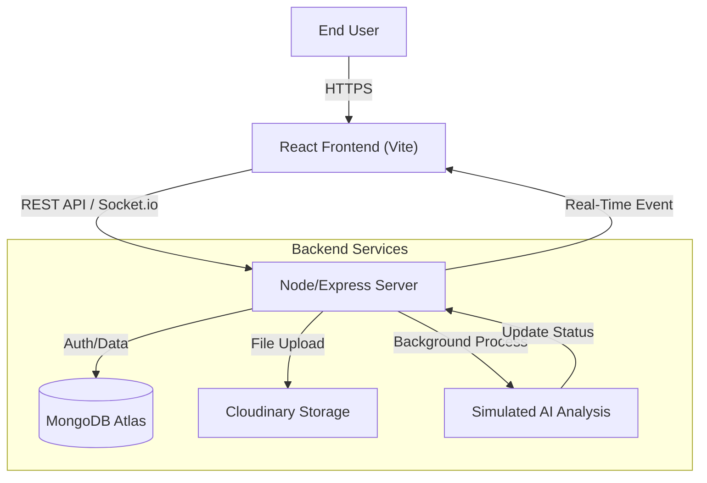

# PulseStream - Video Upload & Streaming Application


PulseStream is a full-stack MERN application designed for seamless video uploading, content analysis, and streaming. It features a robust backend that processes videos for safety, provides real-time status updates, and includes role-based access control.

## Table of Contents
- [Project Overview](#project-overview)
- [Key Features](#key-features)
- [Technology Stack](#technology-stack)
- [System Architecture](#system-architecture)
- [Installation Guide](#installation-guide)
- [API Documentation](#api-documentation)
- [Contributing](#contributing)
- [License](#license)

## Project Overview

PulseStream is a comprehensive solution for video content management. The application allows users to upload videos, which are then processed and analyzed for content sensitivity. The frontend provides a user-friendly interface for managing and viewing videos, with real-time updates on the processing status.

## Key Features

- **Video Management:** Secure video upload and storage using Cloudinary.
- **Content Analysis:** Automated simulation of content sensitivity checks.
- **Real-Time Updates:** Live processing status updates using Socket.io.
- **Role-Based Access Control (RBAC):**
    - **Viewers:** Can watch videos.
    - **Editors/Admins:** Can upload and delete videos.
- **Streaming:** Integrated video player for MP4 streaming.
- **Search & Filter:** Real-time filtering of the video library.

## Technology Stack

- **Frontend:** React (Vite), Tailwind CSS, Axios
- **Backend:** Node.js, Express.js
- **Database:** MongoDB (Mongoose)
- **Real-Time Communication:** Socket.io
- **Storage:** Cloudinary
- **Authentication:** JWT (JSON Web Tokens)

## System Architecture

The application follows a monorepo-style structure with a clear separation of concerns between the frontend and backend.

### System Architecture Diagram


### Design Decisions

- **Simulated AI:** To avoid costs associated with actual video content moderation APIs, the AI analysis is simulated using a `setTimeout` function that randomly assigns a "Safe" or "Flagged" status.
- **Stateless Storage:** Cloudinary is used for video storage to ensure the application is stateless and easily deployable on cloud platforms.
- **Security:** Passwords are hashed using `bcryptjs`, and API routes are protected using a custom middleware that verifies JWT Bearer tokens.

## Installation Guide

### Prerequisites

- Node.js (v14 or higher)
- MongoDB Atlas Account (or a local MongoDB instance)
- Cloudinary Account

### Step 1: Clone the Repository
```bash
git clone <repository-url>
cd pulse-stream
```

### Step 2: Backend Setup
```bash
cd backend
npm install
```
Create a `.env` file in the `backend` folder with the following credentials:
```
PORT=5000
MONGO_URI=your_mongodb_connection_string
JWT_SECRET=your_secret_key_12345
CLOUDINARY_CLOUD_NAME=your_cloud_name
CLOUDINARY_API_KEY=your_api_key
CLOUDINARY_API_SECRET=your_api_secret
```
Create the temporary `uploads` folder and start the server:
```bash
mkdir uploads
npm run dev
```

### Step 3: Frontend Setup
In a new terminal:
```bash
cd frontend
npm install
npm run dev
```
Open your browser at `http://localhost:5173`.

## API Documentation

### Authentication

| Method | Endpoint              | Description           | Access |
| ------ | --------------------- | --------------------- | ------ |
| POST   | /api/users/register   | Register a new user   | Public |
| POST   | /api/users/login      | Login user & get JWT  | Public |

### Video Management

| Method | Endpoint              | Description               | Access        |
| ------ | --------------------- | ------------------------- | ------------- |
| GET    | /api/videos           | Get all videos            | Private       |
| GET    | /api/videos/:id       | Get single video details  | Private       |
| POST   | /api/videos/upload    | Upload a video file       | Editor/Admin  |
| DELETE | /api/videos/:id       | Delete a video            | Owner/Admin   |

## Contributing

Contributions are welcome! If you have any ideas, suggestions, or bug reports, please open an issue or submit a pull request.

## License

This project is licensed under the MIT License. See the [LICENSE](LICENSE) file for details.
